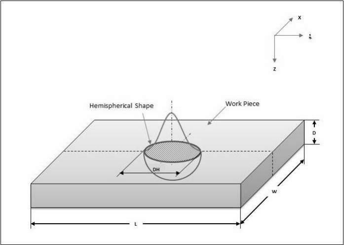
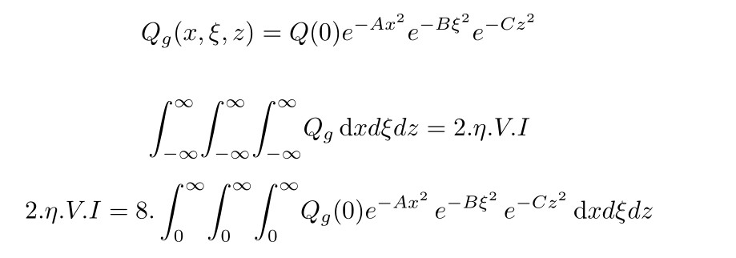
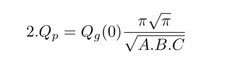
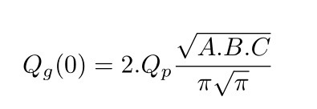
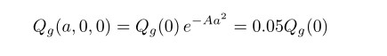
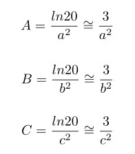
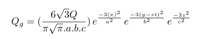
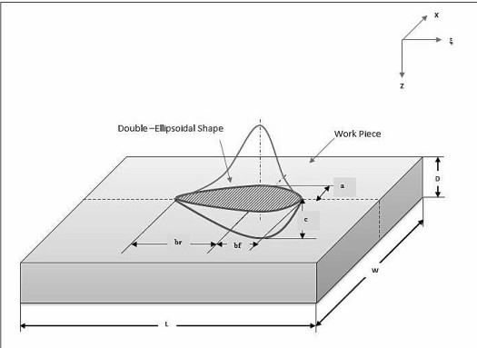
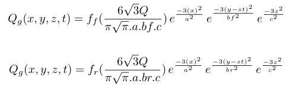

### 双椭球热源
&emsp;&emsp;对于一个椭球热源，热源分布遵循高斯分布：

**公式**：
$$ Q_p=\eta VI   $$ 
单位:W，\eta 为效率系数。
&emsp;&emsp;热源所有的热量都由焊机产生，所以以（0，0，0）为中心，半径分别为a,b,c的高斯体热源为：



求解得到中心位置的热密度$Q_g(0)$为：



需要将热源边界外面的热密度变得足够小,约为中心的0.05左右，列式子为：


可以计算得各个方向的高斯系数为：


最后得到椭球热源方程：


&emsp;&emsp;而对于双椭球热源，只是前后热源长度和热密度不同：


所以双椭球的热源表达式为：

```

!选中定义的A这个体
CMSEL,S,A
!得到最大最小单元编号
*GET,EMAX,ELEM,,NUM,MAX    
*GET,EMIN,ELEM,,NUM,MIN   

ALLSEL

TIME_WELD=65

DT=1

A=0.003

B=0.003

C1=0.004

C2=0.016

FF=0.6

FR=1.4

Q=1000

VEL=1.73e-3

 

NPT=TIME_WELD/DT

NROPT, FULL

!第一个循环，为了让热源移动每一次循环生成一个热源
*DO,i,1,NPT,1

WTIME=(i)

TIME,WTIME

HCENTER=VEL*WTIME

!第二个循环，为每一个单元定义热密度，循环完成，生成一次热源
*DO,jj,EMIN,EMAX,1

!获取当前单元坐标
X=CENTRX(jj)

Y=CENTRY(jj)

Z=CENTRZ(jj)

!定义椭圆前后的热源长度和热密度
*IF,X,GT,HCENTER,THEN

C=C1

F=FF

*ELSE

C=C2

F=FR

*ENDIF
!！！！

!定义热源方程
CSI=X-VEL*(WTIME)
 
PART1=(6*(3**0.5)*F*Q)/(A*B*C*3.14*(3.14**0.5))

PART2=(exp(-3*(Z/A)**2))*(exp(-3*(Y/B)**2))*(exp(-3*(CSI/C)**2))

QF=PART1*PART2

!为每个单元施加热密度
BFE,jj,HGEN,,QF


C=
F=
*ENDDO

!求解
SOLVE
BFEDELE,ALL,ALL

*ENDDO

CMSEL,ALL

```


